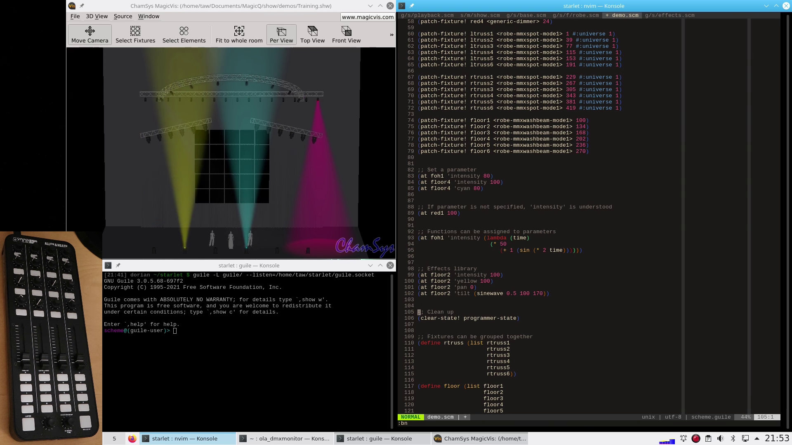
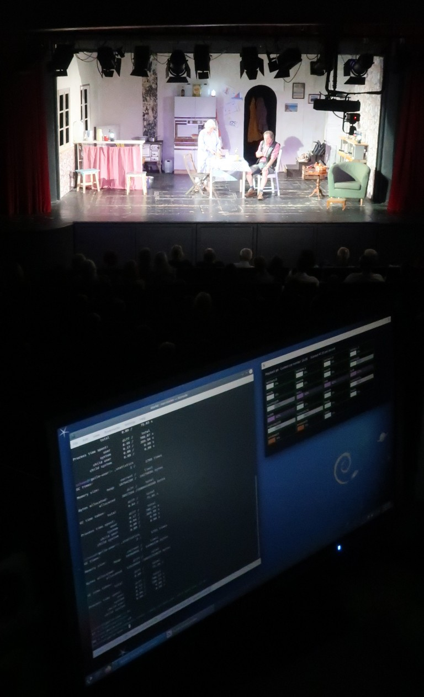

Starlet: Stage lighting control in Lisp
=======================================

Starlet is an experimental Lisp-based domain-specific language (DSL) for
theatrical lighting control.  It's based on
[Guile](https://www.gnu.org/software/guile/) and uses the
[Open Lighting Architecture](https://openlighting.org) to connect with almost
any type of lighting control interface - USB DMX dongles, sACN, Art-Net etc.
Starlet also understands [Open Sound Control](http://opensoundcontrol.org/),
enabling you to control lights and cues with physical faders, knobs and
buttons.

Rather than adding "scripting" as an afterthought, Starlet puts the full power
of the programming language in the spotlight, allowing you to *program* your
lights.

Starlet is explicitly designed for *theatrical* lighting control, with cue
lists, playbacks and multi-part cues being the centre of attention.  Automatic
pre-setting of attributes ("auto move while dark") is the default.


Video demonstration
-------------------

Click for a video demonstration:
[](https://vimeo.com/520547229)


Getting started
---------------

Read [INSTALL.md](INSTALL.md) for basic setup instructions.


Quick tour
----------

Lighting fixtures are referred to by names, rather than numbers:

```
;; Patch some fixtures
(patch-fixture! washL <generic-dimmer> 18))
(patch-fixture! washM <generic-dimmer> 19))
(patch-fixture! washR <generic-dimmer> 20))
(patch-fixture! footlights <generic-dimmer> 23))
(patch-fixture! moverL <robe-dl7s-mode1> 1 #:universe 4))
(patch-fixture! moverR <robe-dl7s-mode1> 101 #:universe 4))

;; Turn the footlights on at full intensity
(at footlights 100)

;; Turn on both moving lights and set colour
(at moverL moverR 60)
(at moverL moverR colour (rgb 45 10 0))
```

The fixture names are normal Scheme variables.  You can do usual things such
as creating lists:

```
(define front-wash (list washL washM washR))
(at front-wash 100)
```

A lighting state is a collection of attribute values, and can be associated
with a variable name:

```
(define home-state
  (lighting-state
     (at footlights 100)
     (at front-wash 100)
     (at moverL moverR 100)
     (at moverL moverR tilt 45)
     (at moverL pan -15)
     (at moverR pan 15)))
```

A cue is formed by wrapping a lighting state inside a *transition effect*,
such as a crossfade or snap (zero-time crossfade).  A cue list is simply a list
of cues:

```
(cue-list

  (cue 0.5
    ;; Tab warmers
    (snap
      (lighting-state
        (at washL washR 30)
        (at washM 40))))

  (cue 0.8
    ;; 6-second fade to blackout
    (crossfade 6 blackout))

  (cue 1
    ;; Act 1, Scene 1
    (crossfade 3
      (lighting-state
        (at front-wash 80)
        (at moverL colour (cmy 25 0 0)))
        (at moverL 25)))

  (cue 2
    (crossfade 3 4   ;; Separate up/down fade times
      (lighting-state
        (at washM 100))))

  (cue 2.5
    (crossfade 2
      (lighting-state
        (apply-state home-state)
        (at moverR 100)))))
```

To 'execute' a cue list, load it into a *playback* object:

```
(define pb (make-playback #:cue-list my-cue-list))
(cut-to-cue-number! pb 1)
(go! pb)
```

By giving names to lighting states, cue lists can be made very concise. The
following example is from a real show:

```
  (cue  6 (snap blue-state))
  (cue  7 (snap office-state))
  (cue  8 (snap blue-state))
  (cue  9 (snap office-state))
  (cue 10 (snap blue-state))
  (cue 11 (snap office-state))
  (cue 12 (crossfade 2 blackout))
  (cue 13 (snap office-state))
```

Since lighting states are first-class objects, you can even do calculations
with them.  In this example (from another real show), the lighting sneaks
progressively darker in a series of slow fades at dramatically appropriate
points:

```
  (cue 2 (crossfade 1 evening-state))
  (cue 3 (crossfade 15 (part-way-between evening-state night-state 0.2)))
  (cue 4 (crossfade 15 (part-way-between evening-state night-state 0.4)))
  (cue 5 (crossfade 15 (part-way-between evening-state night-state 0.6)))
  (cue 6 (crossfade 15 (part-way-between evening-state night-state 0.8)))
  (cue 7 (crossfade 15 night-state))
```

The _structure_ of the cue list is thus separated from the _design_ of the
lighting states.  The structure can often be decided and programmed weeks in
advance of the show, leaving you to concentrate on the designing the states
during the technical rehearsal.


Documentation index
-------------------

* [Patching fixtures](docs/patching.rst)
* [Basic attribute control and building states](docs/basic-control.rst)
* [Cue lists and playbacks](docs/cue-list.rst)
* [The fixture display tool](docs/fixture-display.rst)
* [Physical controls](docs/physical-control.rst)
* [Defining a new type of fixture](docs/new-fixture.rst)


(Non-)warranty
--------------

Starlet is an experiment in progress, and there are no guarantees of any kind
of stability (non-crashiness, consistency of language etc). Don't rely on
syntax and interfaces staying the same, i.e. don't "git pull" right before a
show!  Nevertheless, Starlet is reliable enough for adventurous types to
consider using it for real shows.  Here it is running a show in front of a live
(paying!) audience in June 2023:




About the name
--------------

* Star-let: The little star of your show, of course.
* Let-star (let*): the sequentially evaluated form of the
  [local binding syntax](https://www.scheme.com/tspl4/binding.html#./binding:h4)
  in Scheme.
* [CCT Starlette](http://www.cctlighting.co.uk/125/Theatre_spotlights/Starlette_Luminaire_Range.html):
  a range of theatrical lighting fixtures.


Related projects
----------------

In the almost absurdly specialised category of "Lisp-based stage lighting
systems", Starlet is far from being the only project:

* [Lula](https://www.deinprogramm.de/sperber/lula/) is based on a very similar
  concept, and predates Starlet by over two decades.  Read
  [this paper](https://doi.org/10.1145/507635.507652), which establishes a
  formal basis for describing lighting states in code, and
  [this thesis](https://bibliographie.uni-tuebingen.de/xmlui/bitstream/handle/10900/48174/pdf/lula-thesis.pdf?sequence=1) which goes into much more detail.
* [Afterglow](https://github.com/Deep-Symmetry/afterglow) is a live-coding
  lighting controller based on Clojure.
* [Fivetwelve-CSS](https://github.com/beyondscreen/fivetwelve-css) Controls
  lighting using CSS.  It's not using Lisp, but it does use similar ideas about
  composition.  [Watch this video](https://www.youtube.com/watch?v=ani_MOZt5_c)

You may also be interested in:

* [Guile-OSC](https://github.com/taw10/guile-osc) - Open Sound Control library
  for Guile Scheme.
* [QLC+](https://qlcplus.org/) - the most popular open-source lighting control
  program
* The [stage-lighting topic](https://github.com/topics/stage-lighting) on Github.


Licence
-------

Starlet is free software: you can redistribute it and/or modify it under the
terms of the GNU General Public License as published by the Free Software
Foundation, either version 3 of the License, or (at your option) any later
version.

Starlet is distributed in the hope that it will be useful, but WITHOUT ANY
WARRANTY; without even the implied warranty of MERCHANTABILITY or FITNESS FOR A
PARTICULAR PURPOSE.  See the GNU General Public License for more details.

You should have received a copy of the GNU General Public License along with
Starlet.  If not, see <http://www.gnu.org/licenses/>.
